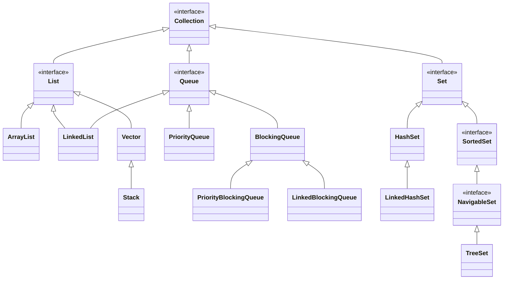
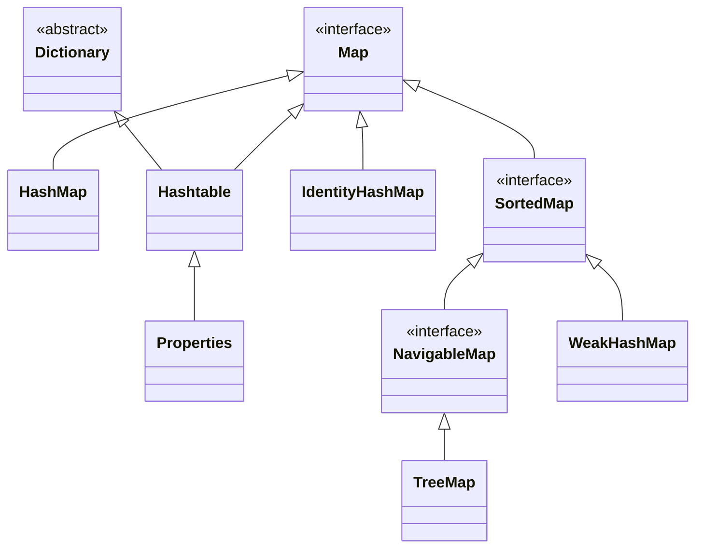

Java Collection Framework defines several classes and interfaces to represent group of individual objects as single entity, i.e. [[data.structure]].  

Although, referred to as a framework, it functions more like a library with a collection of classes and interfaces.

## Collection Hierarchy





### Interfaces

#### Collection 

- Said to be root interface of collection framework (not really though)
- No class implements Collection interface directly

#### Dequeue

- Double-ended Queue.
- Like a doubly linked list.
- Any collection which implements these can be used to implement Stack and Queue.

    Some specific methods for this purpose
    - `void addFirst(Object O)`
    - `void addLast(Object O)`
    - `Object getFirst()`
    - `Object getLast()`
    - `Object removeFirst()`
    - `Object removeLast()`

    Usually `LinkedList` is used for this.

### Classes

- Every Collection class is based on some standard data structure.
- Important ones are listed below along with some use-cases


| Collection Class  | **Data Structure**      | **Suitable for**                                           | **NOT suited for**                   | **Thread Safe** |
|-------------------|-------------------------|------------------------------------------------------------|--------------------------------------|-----------------|
| **ArrayList**     | Resizable Array         | Frequent Retrieval                                         | Frequent Insertion/deleting from mid |  No             |
| **LinkedList**    | Doubly Linked List      | Implementing stack and queue,  Insertion/deleting from mid | Frequent retrieval                   |  No             |
| **Vector**        | Resizable Array         | Frequent Retrieval                                         | Frequent Insertion/deleting from mid |                 |
| **Stack**         | Stack                   | LIFO                                                       |                                      |                 |
|                   |                         |                                                            |                                      |                 |
| **HashSet**       | Hashtable               | Search Operations                                          |                                      |  No             |
| **LinkedHashSet** | Hashtable + Linked List | Cache-based Applications                                   |                                      |  No             |
| **TreeSet**       | Balanced Tree           | Cache-based Applications                                   |                                      |  No             |
|                   |                         |                                                            |                                      |                 |
| **HashMap**       |                         |                                                            |                                      |  No             |
| **Hashtable**     |                         |                                                            |                                      |  Yes            |
| **TreeMap**       |                         |                                                            |                                      |  No             |


### Groups of collections with similar behavior/implementations

Certain groups of collection adhere to a common implementation strategy. Apart from these implementations, these group may also share some of the [[##Behavior]]s.

#### All Collections

Collections are meant to be used for transferring data => All Collection Classes implement: 

- **[[lang.java.lib.interfaces.marker.serializable]]**: To transfer object from one place to another
- **[[lang.java.lib.interfaces.marker.cloneable]]**: When sent from one place to another, the receiver makes a copy of it and operates on it
- Constructors:


#### Legacy Collections

`Vector`, `Stack` and `Hashtable`

- Some legacy collections have additional "legacy" methods along with the other methods which they have inherited. These names may sound a bit boomer or longer, since they are legacy.

For example, ˇaddElements(Object O)` in Vector and `enumeration()` in all legacy classes.

It is recommended to use the modern methods and the legacy methods are only kept for backward compatibility.


#### Sorted, Navigable, Tree

`TreeSet` and `TreeMap`

##### Sorted

| Methods |Returns |
|-----------|---------------|
| `first()` | first element |
| `last()`  | last element  |
| `headSet(a)` | elements less than *a*  |
| `tailSet(a)` | elements greater than or equal to *a* |
| `subSet(a,b)` | elements between *a* and *b* including *a* |
| `comparator()` | Comparator object which defines underlying sorting technique  |
|                   |   (If we're using default natural sorting order, then it simply returns null) |

Sorted collections use [[lang.java.lib.collection.comparable]] or [[lang.java.lib.interfaces.func.comparator]] to determine the natural ordering of the objects. If the class doesn't implement `Comparable` and no `Comparator` is passed, adding elements to the collection will result in a [[NullPointerException|dev.issues.exception.types.unchecked.null pointer]].

Same methods are also applicable for Map.

#### Navigable

Defines several methods for navigation.


#### Hash-based collections
`HashMap`, `HashSet`, `Hashtable` ...

- `HashSet` is a wrapper on top of `HashMap` which stores its values in the `key`s (so as to avoid duplicates) and stores some vague value for the `value` part. 


##### Internal Implementation

Implementation of hash, the structure and rehashing is similar in all hash-based collections.

```java
HashMap <K,V> implements Map<K,V>
{
Entry <K,V> {} //Inner class
Entry next; //reference to another entry to store entries like linked lists

int hash; //Hashvalue of key to avoid calculating everytime its  needed
}
```

- Initially, it is stored as an array of initial capacity (0-15 if initial cap is 16).
- Once the array is filled more than 75% (load factor - 0.75), the table size doubles to 32. The hashtable is rehashed (Internal data structures are rebuit)
- Java 8 improvement: When the number of nodes in a HashMap reaches the TREEIFY_THRESHOLD (constant), the nodes are converted to TreeNode. Basically, from linked list to a balanced tree. This improves the worst case performance from O(n) to O(log n). After the HashMap becomes small due to removal or resizing, TreeNodes are converted back to nodes. Since, HashSet also uses HashMap - it also benefits from this.
- **HashMap Bucket Resizing Overhead: You should create HashMap with initial capacity close to your expected volume. If its too small, and the load is in millions, whenever the bucket will reach its load factor it will resize and rehash → which is a very costly operation. Also, make sure to use full capacity else a lot of memory of unused blocks will go wasted**.

#### Linked list based

- References not stored contiguously → no shift operations required while adding/removing elements


#### Concurrent Collections

- BlockingQueue

#### Enum

#### Fixed size collections

`ArrayBlockingQueue` , `LinkedBlockingQueue`


## Behavior

💡 Collection classes only deviate from behaviors of their parent when it stops them from implementing their intended behavior.

### Allowed elements

- All collections **allow heterogeneous objects** (except `TreeSet` and `TreeMap`).
    `TreeSet` and `TreeMap` store elements in a particular sorted order by comparing them. Comparing null values throws `NullPointerException` which is why they don't allow it.
- Duplicate and null values
    - Adding duplicates in collections which don't allow it doesn't generally throw any exception. Usually the `add()` or `addAll()` method will just return `false` in such cases.

    |        | Duplicates         | null insertion    |  
    |--------|--------------------|-------------------|
    |`List`  | Allowed            | allowed           |
    |`Set`   | NOT Allowed        | allowed           |
    |`Queue` | Allowed            | allowed     |  
    |`Map`   | Allowed for values | allowed           |
 

- `List` is the most straighforward implementation. Similar to an array of a linked list, it allows duplicates and keeps the ordering as you insert it. No acrobatics. It also allows null values.
- `Set` as the name suggests, is like mathematical sets. By definition, mathematical sets can't have duplicates. But there can be "null" or empty sets. So it allows null values.
-  `Queue`s in general allow duplicates. It generally doesn't allow null elements either but if allowed - it should be avoided

    From Javadoc:
    > Queue implementations generally do not allow insertion of null elements, although some implementations, such as LinkedList, do not prohibit insertion of null. Even in the implementations that permit it, null should not be inserted into a Queue, as null is also used as a special return value by the poll method to indicate that the queue contains no elements.

- null values are treated as any other values in collections which allow it. For example, `Set`s allow null values but they don't allow duplicates, so even if you add `null` twice, it will be treated as one. Similarly, `Map`s only allow one `null` value in key and multiple `null` value as values.

### Capacity

- **Default Initial Capacity**: The initial capacity assigned to a Collection class object by default, if not specified while initializing the object. 
- **Fill Ratio/Load Factor**: The percentage or ratio of capacity which when reached will result in increasing of the capacity. 
- **Resizing Strategy**: How much the capacity will be increased upon reaching threshold.

For example, if the initial default capacity is 10 and fill ratio is 0.7 - the capacity will increase once 7 places are filled.


#### Common patterns

Although there is no universal pattern for these properties, but some common patterns are observed due to the design decisions.

|                            | Default Initial Capacity | Load factor | Resizing Strategy                                   |
|----------------------------|--------------------------|-------------|-----------------------------------------------------|
| Array-based collections    | 10                       | 1+          | Triggered when array is full  1.5x + 1 in ArrayList, 2x in Vector |
| Hash-based collections     | 16                       | 0.75        | 2x                                                  |
| Fixed-capacity collections | Explicit                 | NA          | NA                                                  |

- Initial capacity for hash-based collections is and should be chosen as a reasonable balance between space efficiency and performance.
- Array-based collections usually have slightly lower default capacities to avoid unessecary memory allocation. New array is created with the new capacity once array is full. Keepign initial capacity also prevents too many elements to be copied while resizing.
- Some collections which are based on dynamic data structures, like `LinkedList` and **Tree-based collections**, and have default initial capacity as 0. Elements are added as they come.
- `Vector` also allows to pass an incrementalCapacity by which the capacity will be increased if it is full (instead of doing 2x).

### Ordering of elements 

In general:

- `List` collections maintain insertion order.
- `Queue` FIFO
- `Set`: Ordering usually doesn't matter in mathematical sets, so the interface leaves ordering upto its implementations.

But ordering of elements is based more on the behavior/data structure the collection class intends to implement:

- **Linked collections** (Linked*): Maintain insertion order.
- **Hash-based collections** (Hash*): Elements stored in order of hash codes.
- **Sorted Collections** (Tree* and Sorted*): Elements sorted based on natural order or provided `Comparator`  
- **Priority-based Collections**: Ordered according to priority
- **Stack**: Even though it implements list, it orders elements in LIFO.

### Constructors


- Almost all Collection framework classes have the usual nullary constructor.
    ```java
        Collection<T> c = new CollectionImplementation<T>();
    ```
    Exceptions: Fixed size collections and some concurrent collections

- Most mainstream `Collection` implementations provide an overloaded constructor that accepts object of any `Collection` implementation. 
    ```java
        Collection<T> c = new CollectionImplementation<T>(someOtherCollection);
    ```
    Exceptions:
    - Legacy collections
    - Tree/Sorted collections: because how will it decide the sorting of ths usual collections.
    - Concurrent collections: 
        - Initializing concurrent collection with non-concurrent collection might cause thread-safety issues
        - Some concurrent collection might require more information for initializing
    - Fixed-size collections: Taking in collection which exceed the fixed size might cause issue

- All `Map` implementations provide an overloaded constructor which accepts object of `Map` (including legacy, sorted and concurrent ones).
    ```java
        Map<K,V> m = new MapImplementation<K,V>(someOtherMap);
    ```

Some other collections offer additional overloaded constructors:

- **Array-based** collections and **Fixed size** collections:
    ```java
        ArrayList<T> al2 = new ArrayList<T>(int initialCapacity);
    ```
- **Hash-based collections**
    ```java
        Hash___ h = new Hash___(int initialCapacity);
        Hash___ h = new Hash___(int initialCapacity, float loadFactor);
    ```
- **Tree/sorted** collections
    ```java
        Tree___(Comparator<? super K> comparator)
        Tree___(Sorted___<? extends K, ? extends V> m)
    ```
- `Vector`
    ```java
    Vector v = new Vector(int initialCapacity, int incrementalCapacity);
    ```
## Utilities

### Iterating over collections

Although there are multiple iterators offered by the framework. The most common usage is as below:

```java
  Iterator i = c.iterator();
  while(i.hasNext()){
    i.next();
  }
```

For more details about different types of iterators. See [[lang.java.lib.collection.iterators]]


### `Collections` Class

Utility class (`java.util.package`) which defines several methods for collection objects.
Most of these methods are static.

#### Methods

##### `static sort()` and `static sort(Comparator c)`

Sorts the collection objects (if [[lang.java.lib.collection.comparable]]) either based on their natural ordering, or based on the [[lang.java.lib.interfaces.func.comparator]] if passed.

⚠️ If the class doens't implement `Comparable` and `sort` is called without a `Comparator`, it will throw a [[ClassCastException|dev.issues.exception.types.unchecked.class cast exception]].


## Important Distinctions 

### Array vs ArrayList

The main difference lies in the dynamic and resizeable nature of `ArrayList`. You don't even have to specify an initial size in `ArrayList`

### Common distinction between legacy collections and their modern counterparts

**ArrayList vs Vectors / HashMap vs Hashtable**

Legacy collections are thread-safe. Their modern counterparts aren't.

`Vector`(and even `Stack`)/Hashtable is thread-safe (most methods are synchronised)
`ArrayList`/`HashMap` is not.

💡 If something is thread-safe, it will inevitably have a lower performance in comparison to a corresponding non-synchronised something.

### `size()` vs `capacity()`

- size = number of objects currently
- capacity = number of objects which can be accommodated


## References

 - [Collections Framework Overview - Java - Oracle Documentation](https://docs.oracle.com/javase/8/docs/technotes/guides/collections/overview.html#:~:text=Not%2C%20strictly%20speaking%2C%20a%20part%20of%20the%20collections,and%20relies%20on%20some%20of%20the%20same%20infrastructure.)
 - [Why some collections can't allow heterogenous objects?](https://andbin.dev/java/why-some-collections-cannot-be-heterogeneous)
 - [Understand Queue Insertion - Stack Overflow](https://stackoverflow.com/questions/28147076/understanding-queue-insertion)

### Hashmaps
- [How HashMap works in Java? With Animation!! whats new in java8 tutorial](https://www.youtube.com/watch?v=c3RVW3KGIIE)
- [Java 8 HashMap Implementation and Performance - DZone Java](https://dzone.com/articles/java8-hashmap-implementation-and-performance)
- [Java Hashed Collections](https://www.developer.com/design/java-hashed-collections/)
- [What are the differences between hashtable and hashmap? (Not specific to Java)](https://stackoverflow.com/questions/36313817/what-are-the-differences-between-hashtable-and-hashmap-not-specific-to-java)