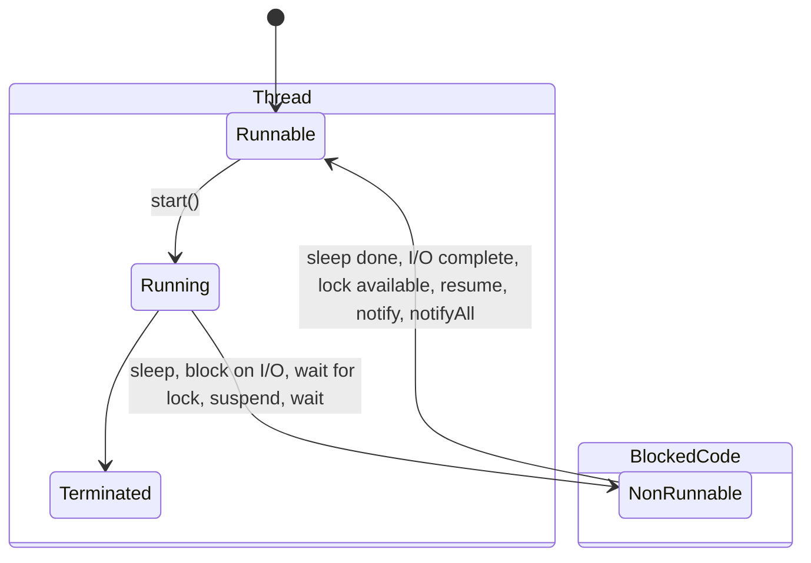

Components involved in [[lang.java.lib.multithreading]] in Java:

- Threads
- Thread Scheduler
- Thead Pool
- Executor Service

## Threads

- One Java thread corresponds to one CPU thread.

### Life Cycle

## Thread Scheduler

Task executes for a predefined slice of time and then re-enters pool of ready tasks.

Next task decided based on priority and other factors.

Uses [[execution.scheduling.pre-emptive]] and [[execution.scheduling.time slicing]]

### Thread Pool

If you use [[lang.java.lib.multithreading.executor service]] to initialize a thread pool.

- Threads initialized will pick up tasks from the queue of tasks given to the executor service
- Since multiple threads are accessing this queue simultaneously, executor service uses a [[BlockingQueue|lang.java.lib.collection#concurrent-collections]].

#### Ideal Pool Size

- **CPU Intensive tasks**: Tasks which block the CPU cores. For example, intensive hashing or cryptographic algorithms. In such cases, if you have even thousands of tasks, the number of threads running at a time will be equal to the number of cores on your CPU. So if you have too many threads, CPU will simply keep rotating between all these tasks and won't be able to actually complete any of these quick. 

    In such cases, **Ideal Pool Size = CPU Core count**

    Use [[lang.java.lib.classes.runtime]] to get the core count and initialize executor service with that.

    Other consideration: How many other applications (or executors/threads are running on the same CPU)
    
- **I/O Intensive tasks**: Tasks which don't really need the CPU, like input/output from user, or calls to a remote service. In such cases, even if you create few threads, CPU will keep waiting for a response to come back, staying idle. 

Ideal pool size will be higher in such cases.

Exact number will depend on the rate of task submissions and average task wait time. Too many threads will increase memory consumption too.

#### Types of Pools

- FixedThreadPool
- CachedThreadPool
- ScheduledThreadPool
- SingleThreadedExecutor

## References

- [Java Concurrency - Defog Tech - YouTube Playlist](https://www.youtube.com/playlist?list=PLhfHPmPYPPRk6yMrcbfafFGSbE2EPK_A6)