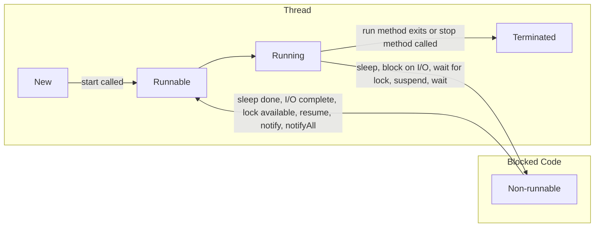

## Creating a thread

Two ways-

1. extend [[lang.java.lib.classes.thread]] class
2. implement [[lang.java.lib.interfaces.runnable]] interface

Implement the `run()` method -> this is the code which will get executed when the thread runs.

## Executing Threads

- Call `start()` method

    The part after start method call is executed immediately. If you want to execute some part of the code after the thread execution, use `join()` method.

    ```java
        Thread thread = new ApnaThread();

        thread.start();

        //this part gets executed immediately after start() is called - while the thread is running

        thread.join();

        //this part gets executed after the thread execution is completed.
    ```

- Use [[lang.java.lib.interfaces.executor service]]

## Thread Execution


## Java Thread Life Cycle



## Thread Scheduler

Task executes for a predefined slice of time and then re-enters pool of ready tasks.

Next task decided based on priority and other factors.

Uses [[execution.scheduling.pre-emptive]] and [[execution.scheduling.time slicing]]
